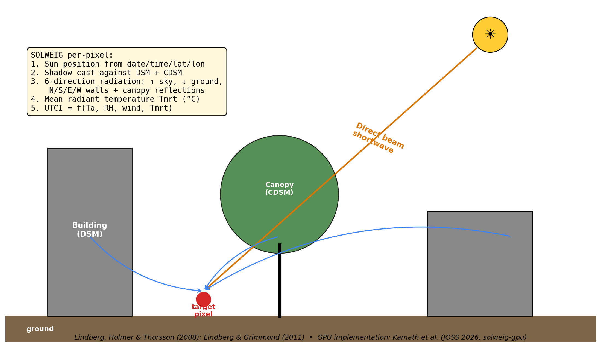

# radiant-temperature

A reproducible analysis of the pedestrian heat impact of Durham's 2025–2028
street tree planting program in the Hayti neighborhood. The study quantifies
the change in mean radiant temperature (Tmrt) and the Universal Thermal
Climate Index (UTCI) at 1 m resolution on a heatwave day, comparing a
baseline run against two canopy growth scenarios.

The analysis uses the SOLWEIG model (Lindberg et al., 2008) accelerated on
GPU via `solweig-gpu` (Kamath et al., 2026). Inputs are derived from public
data: NC Phase 3 LiDAR for terrain and structures, Overture Foundation
buildings for footprint correction, EnviroAtlas land cover, NOAA HRRR
analysis for meteorological forcing, and the Durham Open Data Portal for the
locations of planned plantings.

## Headline finding

For the 245 planned planting sites within a 2 km × 2 km tile centered on
Hayti, peak-hour ΔUTCI at the planted pixels falls between −4.7 °C (year 10
canopy, 5 m height) and −5.8 °C (mature canopy, 12 m height) on June 23, 2025
(99 °F at KRDU, clear skies). About 58 percent of planted pixels cross at
least one WHO heat-stress category, typically from extreme to very strong
heat stress. The worst-cooled single pixel falls by 10 °C. Tile-wide mean
ΔUTCI is −0.01 °C, indicating that the intervention is local rather than
neighborhood scale.



## Repository tour

The analysis is organised as four marimo notebooks under `notebooks/`. Each
notebook is a regular Python file. Cells are idempotent: an expensive step
that has already produced its output is skipped on re-run.

| notebook | purpose |
|---|---|
| `0_fetch_data.py` | Downloads Durham planting sites, EnviroAtlas land cover, KRDU observations, HRRR meteorological forcing, and Overture buildings for the AOI. Ends with a MapLibre view of the raw inputs. |
| `2_prepare_buildings.py` | Builds the four SOLWEIG-ready rasters from raw LiDAR, applies the Overture footprint patch to the building DSM, and shows pre- and post-patch inspector views. |
| `1_run_scenarios.py` | Runs SOLWEIG for the baseline, then burns canopy disks for the year10 and mature scenarios and runs SOLWEIG for each. Includes the baseline sanity report and a final inspector that overlays every output layer. |
| `3_analyze_results.py` | Computes the headline statistics, regenerates the figures used in the conference deck, and captures slide-ready PNG screenshots of the inspector. |

Reusable code lives in `src/`:

| module | summary |
|---|---|
| `src/aoi.py` | AOI primitives (centre, size, simulation date, tile bounding boxes). Single source of truth for relocation. |
| `src/geo.py` | PROJ and GDAL environment setup. |
| `src/met.py` | HRRR analysis fetch and UMEP own-met file writer. |
| `src/buildings.py` | LiDAR DSM and DEM via PDAL, MULC reproject, Overture patch. |
| `src/scenarios.py` | Canopy disk burn-in for the two scenarios. |
| `src/solweig_runner.py` | Wrapper around `solweig_gpu.thermal_comfort` with idempotency and wall-cache reuse. |
| `src/evaluate.py` | Physical sanity checks and headline statistics. |
| `src/figures.py` | Every figure used in the conference deck. |
| `src/inspector.py` | Self-contained MapLibre inspector bundle, daemon HTTP server, and headless screenshot capture. |
| `src/compare_obs.py` | Cross-checks of HRRR forcing against KRDU observations and Open-Meteo reanalysis. |

The folder `archive/` holds prior project artefacts (the 5-day sprint scripts,
slide deck, presentation notes, decision logs, and historical pod runs) and
is gitignored.

## Getting started

### 1. Prerequisites

- Linux or macOS (Windows requires WSL2).
- A `conda` or `mamba` installation. Miniforge is recommended.
- Roughly 10 GB of free disk for the conda environment and cached inputs.
- `git` on PATH. The conda environment provides `gdal-bin` and `pdal`.
- Optional: an NVIDIA GPU with CUDA. Without one, SOLWEIG falls back to CPU.
- Optional: `google-chrome` on PATH if the headless screenshot cell in
  notebook 3 is to be exercised.

### 2. Create the environment

```bash
git clone <this-repo> radiant-temperature
cd radiant-temperature
conda env create -f environment.yml -p ./env
conda activate ./env
```

The environment installs `marimo` along with `solweig-gpu`, `rasterio`,
`geopandas`, `pdal`, `pytorch`, `dynamical-catalog`, and `overturemaps`.

Verify the install:

```bash
python -c "import marimo, solweig_gpu, rasterio, geopandas, pdal; print('ok')"
```

### 3. Open the first notebook

Marimo notebooks are plain Python files. Two invocation modes are useful.

```bash
# Edit interactively; opens a reactive UI in the browser.
marimo edit notebooks/0_fetch_data.py

# Run headless and inspect outputs on disk.
marimo run notebooks/0_fetch_data.py
```

Both modes print a local URL (default `http://localhost:2718`).

### 4. Recommended execution order

1. `notebooks/0_fetch_data.py` retrieves everything that does not require
   PDAL.
2. `notebooks/2_prepare_buildings.py` performs the LiDAR retrieval and the
   Overture-gated building DSM patch. This is the slowest notebook on a
   first run.
3. `notebooks/1_run_scenarios.py` runs SOLWEIG for the baseline and both
   scenarios. CPU runs of the 2 km × 2 km Hayti tile take roughly 30 minutes
   per scenario. An A6000 finishes in roughly 2 minutes per scenario.
4. `notebooks/3_analyze_results.py` regenerates the figures and writes the
   headline file under `outputs/{prefix}/`.

The numbering reflects the conceptual reading order. The execution order is
0 → 2 → 1 → 3 because notebook 1 needs the patched `Building_DSM.tif`
produced by notebook 2.

### 5. Quick smoke test

```bash
python -c "from src.aoi import AOI_NAME, SIM_DATE; print(AOI_NAME, SIM_DATE)"
# durham_hayti 2025-06-23
```

### 6. Selecting a different AOI

Configuration lives in `src/aoi.py`. Edit `AOI_NAME`, `AOI_CENTER_LAT`,
`AOI_CENTER_LON`, `AOI_SIZE_KM`, and `SIM_DATE`, then run all four notebooks
in order. Outputs are namespaced by `OUTPUT_PREFIX`, which defaults to
`AOI_NAME` and may be overridden via the environment variable of the same
name or via the prefix input field at the top of notebooks 1 and 3.

## Data sources

| source | role | notes |
|---|---|---|
| NC Phase 3 LiDAR (2015) via NOAA dataset 6209 | First-return DSM, ground DEM | Native EPSG:6346, metres. Pulled by PDAL via Entwine point tile. |
| Overture Foundation buildings | Footprint and height for the DSM patch | GeoJSON at 4326. |
| EnviroAtlas Durham 1 m MULC (2010) | Land cover, reclassified to UMEP codes | EPSG:26917, reprojected to 32617. |
| Durham Open Data — Trees & Planting Sites | Locations of planned plantings | Filtered to `present == "Planting Site"`. |
| NOAA HRRR analysis via `dynamical-catalog` | Hourly meteorological forcing | Anonymous S3, no API key required. |
| Iowa Mesonet KRDU ASOS | Validation observations | Used to confirm the simulation date selection and to cross-check forcing. |

## Folder layout after a complete run

```
radiant-temperature/
├── README.md
├── environment.yml
├── notebooks/
│   ├── 0_fetch_data.py
│   ├── 1_run_scenarios.py
│   ├── 2_prepare_buildings.py
│   ├── 3_analyze_results.py
│   └── assets/
├── src/
├── inputs/
│   ├── raw/durham/
│   └── processed/
│       ├── {prefix}_baseline/
│       ├── {prefix}_scenario_year10/
│       └── {prefix}_scenario_mature/
├── outputs/
│   └── {prefix}/
│       ├── headline.txt
│       ├── figures/
│       └── diffs/
├── figures/
└── archive/   (gitignored)
```

## Citations

- Lindberg, F., Holmer, B., Thorsson, S. (2008). SOLWEIG 1.0 — Modelling
  spatial variations of 3D radiant fluxes and mean radiant temperature in
  complex urban settings. *International Journal of Biometeorology* 52,
  697–713.
- Lindberg, F., Grimmond, C. S. B. (2011). The influence of vegetation and
  building morphology on shadow patterns and mean radiant temperatures in
  urban areas. *Theoretical and Applied Climatology* 105, 311–323.
- Bröde, P., Fiala, D., Błażejczyk, K., Holmér, I., Jendritzky, G., Kampmann,
  B., Tinz, B., Havenith, G. (2012). Deriving the operational procedure for
  the Universal Thermal Climate Index (UTCI). *International Journal of
  Biometeorology* 56, 481–494.
- Kamath, H. G., Sudharsan, N., Singh, M., Wallenberg, N., Lindberg, F.,
  Niyogi, D. (2026). SOLWEIG-GPU: GPU-Accelerated Thermal Comfort Modeling
  Framework for Urban Digital Twins. *Journal of Open Source Software*
  11(118), 9535.
- Lindberg, F., Grimmond, C. S. B., Gabey, A., Huang, B., Kent, C. W., Sun,
  T., et al. (2018). Urban Multi-scale Environmental Predictor (UMEP): An
  integrated tool for city-based climate services. *Environmental Modelling
  and Software* 99, 70–87.

## Acknowledgements

Data products from Durham Urban Forestry, the United States Environmental
Protection Agency (EnviroAtlas), NC OneMap, the National Oceanic and
Atmospheric Administration, and the Overture Foundation made this analysis
possible.
